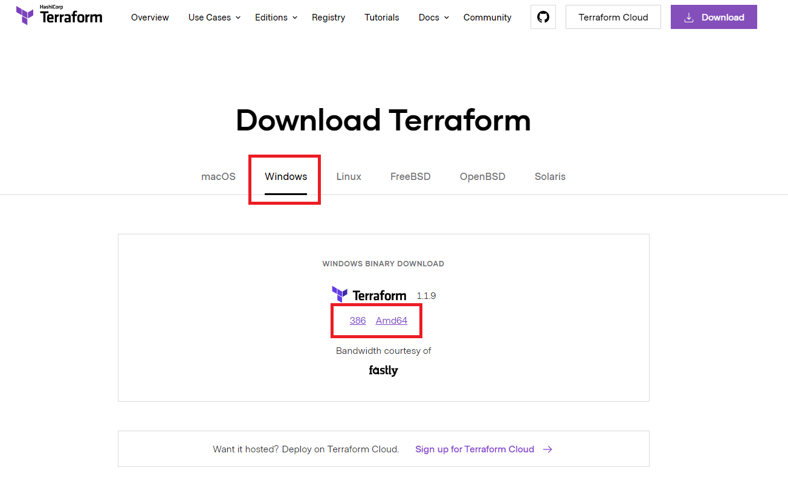

# Getting Started with Terraform
- [Getting Started with Terraform](#getting-started-with-terraform)
  - [Prerequisites](#prerequisites)
  - [Installation](#installation)
  - [Create Directory/Configuration File](#create-directoryconfiguration-file)
  - [Initialize Terraform](#initialize-terraform)
  - [Provision Resource](#provision-resource)
  - [Destroy Infrastructue](#destroy-infrastructue)
  - [Next Steps](#next-steps)

Terraform is the most popular langauge for defining and provisioning infrastructure as code (IaC). In this guide you will learn how to set up Terraform in a Windows environment, provision a Docker container, and how to destroy it.

## Prerequisites
1. Terraform 1.1.9 (or current)
2. Windows 7/10
3. 

## Installation
Visit [Terraform.io](https://www.terraform.io/downloads.html) to download the compressed binary package for your current machine/platform.



## Create Directory/Configuration File
Next, we suggest creating a new directory on your local machine with the `mkdir` command.

```shell
$ mkdir terraform-demo
$ cd terraform-demo
```

In the new directory, create a file for your Terraform configuration code to reside in using the `touch` command.

```shell
$ touch main.tf
```

Paste the following lines into the file.

```hcl
terraform {
  required_providers {
    docker = {
      source = "kreuzwerker/docker"
    }
  }
}
provider "docker" {
    host = "unix:///var/run/docker.sock"
}
resource "docker_container" "nginx" {
  image = docker_image.nginx.latest
  name  = "training"
  ports {
    internal = 80
    external = 80
  }
}
resource "docker_image" "nginx" {
  name = "nginx:latest"
}
```

## Initialize Terraform
Initialize Terraform with the `init` command. The AWS provider will be installed. 

```shell
$ terraform init
```

## Provision Resource
Check for any errors. If the `init` command ran successfully, provision the resource with the `apply` command.

```shell
$ terraform apply
```

The command will take up to a few minutes to run and will display a message indicating that the resource was created.

## Destroy Infrastructue
Finally, destroy the infrastructure using the `destroy` command.

```shell
$ terraform destroy
```

Look for a message are the bottom of the output asking for confirmation. Type `yes` and hit ENTER. Terraform will destroy the resources it created earlier.

## Next Steps
Congratulations! You have learned how to install and configure Terraform along with provisioning and destroying infrastructure. You can now vastly shorten the time required to provision infrastructure.

 These steps introduce the beginning of Terraform's value and will be built upon in further guides. Please continue to the next guide on how to modify your infrastructure.