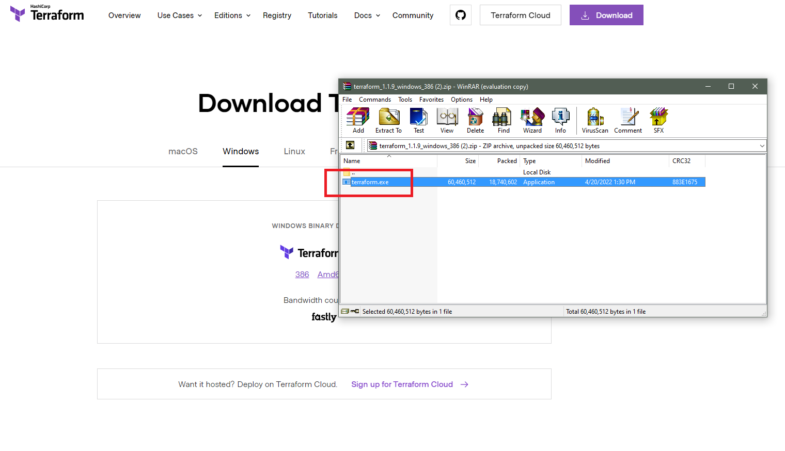
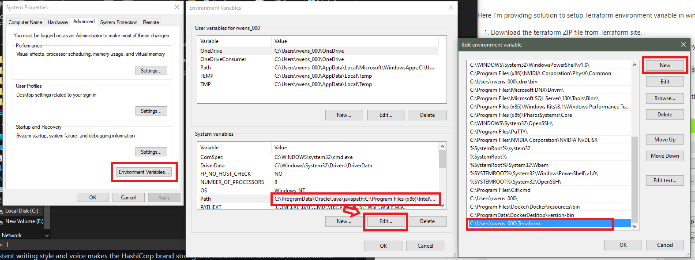
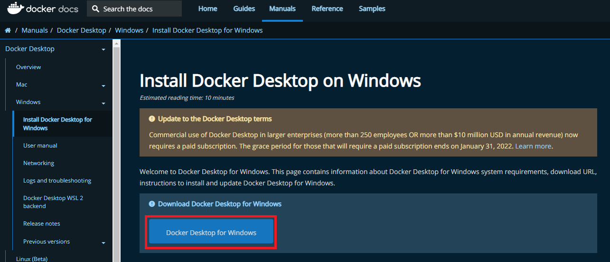
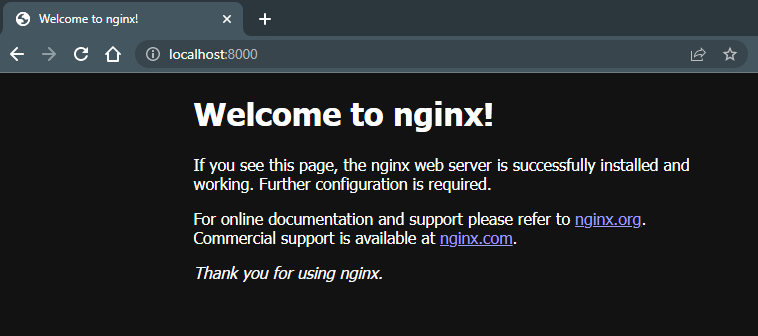

# Getting Started with Terraform for Windows 10
## Table of Contents
- [Getting Started with Terraform for Windows 10](#getting-started-with-terraform-for-windows-10)
  - [Table of Contents](#table-of-contents)
  - [Learning Objectives:](#learning-objectives)
  - [Prerequisites](#prerequisites)
- [Installation](#installation)
  - [Terraform Installation](#terraform-installation)
  - [Windows Subsystem for Linux (WSL2) Installation](#windows-subsystem-for-linux-wsl2-installation)
  - [Docker Desktop for Windows Installation](#docker-desktop-for-windows-installation)
- [Provisioning/Destroying Infrastructure](#provisioningdestroying-infrastructure)
  - [Create Directory/Configuration File](#create-directoryconfiguration-file)
  - [Initialize Terraform](#initialize-terraform)
  - [Provision Resource](#provision-resource)
  - [Destroy Infrastructue](#destroy-infrastructue)
- [Next Steps](#next-steps)

Terraform is the most popular langauge for defining and provisioning infrastructure as code (IaC). This guide will cover the following:

## Learning Objectives:
1. How to set up Terraform in a Windows environment
2. How to provision an NGINX server on a Docker container using Terraform
3. How to destroy said container

## Prerequisites
1. Windows 10
2. Terraform 1.1.9 (or current)
3. Docker Desktop for Windows
4. Windows Subsystem for Linux (WSL2)

# Installation
We suggest downloading and installing all prerequisites as a first step.

## Terraform Installation
Visit [Terraform.io](https://www.terraform.io/downloads.html) to download the compressed binary package for your current machine/platform.


Open the zipped file to find "Terraform.exe". Extract it to your preferred location and copy the file path.



Next, open Windows Environment Variables (Control Panel > System > System Settings > Environment Variables). In the "System variables" box select "Path" and click the "Edit" button. In the "Edit environment variable" window, click the "New" button and enter the file path you copied earlier. Now click the "OK" button.



Finally, ensure the installation is complete by opening a command prompt and navigating to the folder containing Terraform. Enter the following command:

```shell
$ C:\Users\[USER NAME]\Terraform>terraform -help
```

You will see the following output:

```shell
Usage: terraform [global options] <subcommand> [args]

The available commands for execution are listed below.
The primary workflow commands are given first, followed by
less common or more advanced commands.

Main commands:
  init          Prepare your working directory for other commands
  validate      Check whether the configuration is valid
  plan          Show changes required by the current configuration
  apply         Create or update infrastructure
  destroy       Destroy previously-created infrastructure

All other commands:
  console       Try Terraform expressions at an interactive command prompt
  fmt           Reformat your configuration in the standard style
  force-unlock  Release a stuck lock on the current workspace
  get           Install or upgrade remote Terraform modules
  graph         Generate a Graphviz graph of the steps in an operation
  import        Associate existing infrastructure with a Terraform resource
  login         Obtain and save credentials for a remote host
  logout        Remove locally-stored credentials for a remote host
  output        Show output values from your root module
  providers     Show the providers required for this configuration
  refresh       Update the state to match remote systems
  show          Show the current state or a saved plan
  state         Advanced state management
  taint         Mark a resource instance as not fully functional
  test          Experimental support for module integration testing
  untaint       Remove the 'tainted' state from a resource instance
  version       Show the current Terraform version
  workspace     Workspace management

Global options (use these before the subcommand, if any):
  -chdir=DIR    Switch to a different working directory before executing the
                given subcommand.
  -help         Show this help output, or the help for a specified subcommand.
  -version      An alias for the "version" subcommand.
```

## Windows Subsystem for Linux (WSL2) Installation
Open an **ADMINISTRATOR** Command Prompt and enter the following command:

```shell
$ wsl --install
```

You will see the following output:

```shell
Copyright (c) Microsoft Corporation. All rights reserved.

Usage: wsl.exe [Argument] [Options...] [CommandLine]

Arguments for running Linux binaries:

    If no command line is provided, wsl.exe launches the default shell.

    --exec, -e <CommandLine>
        Execute the specified command without using the default Linux shell.

    --
        Pass the remaining command line as is.
continued...
```

Now restart your system. If you have additional questions or have problems with the install, see https://docs.microsoft.com/en-us/windows/wsl/install.

## Docker Desktop for Windows Installation

Visit https://docs.docker.com/desktop/windows/install/ and click the "Docker Desktop for Windows" Button.



An install window should appear. Follow the prompts and ensure "**WSL 2**" is chosen in the Configuration page.

# Provisioning/Destroying Infrastructure

## Create Directory/Configuration File
We suggest creating a new directory on your local machine with the `mkdir` command.

```shell
$ mkdir terraform-demo
$ cd terraform-demo
```

In the new directory, create a .txt file named "Main" for your Terraform configuration code to reside in and paste the following lines into the file.

```hcl
terraform {
  required_providers {
    docker = {
      source  = "kreuzwerker/docker"
      version = ">= 2.13.0"
    }
  }
}

provider "docker" {
  host    = "npipe:////.//pipe//docker_engine"
}

resource "docker_image" "nginx" {
  name         = "nginx:latest"
  keep_locally = false
}

resource "docker_container" "nginx" {
  image = docker_image.nginx.latest
  name  = "tutorial"
  ports {
    internal = 80
    external = 8000
  }
}
```

After saving, rename the file to "Main.tf" and click "Yes" when prompted about changing the file type.

## Initialize Terraform
Initialize Terraform with the `init` command.  

```shell
$ terraform init
```

You will see the following output:

```shell
Initializing the backend...

Initializing provider plugins...
- Finding latest version of kreuzwerker/docker...
- Installing kreuzwerker/docker v2.16.0...
- Installed kreuzwerker/docker v2.16.0 (self-signed, key ID BD080C4571C6104C)

Partner and community providers are signed by their developers.
If you'd like to know more about provider signing, you can read about it here:
https://www.terraform.io/docs/cli/plugins/signing.html

Terraform has created a lock file .terraform.lock.hcl to record the provider
selections it made above. Include this file in your version control repository
so that Terraform can guarantee to make the same selections by default when
you run "terraform init" in the future.

Terraform has been successfully initialized!

You may now begin working with Terraform. Try running "terraform plan" to see
any changes that are required for your infrastructure. All Terraform commands
should now work.

If you ever set or change modules or backend configuration for Terraform,
rerun this command to reinitialize your working directory. If you forget, other
commands will detect it and remind you to do so if necessary.
```

## Provision Resource
Check for any errors. If the `init` command ran successfully, provision the resource with the `apply` command.

```shell
$ terraform apply
```

You will see the following output:

```shell
Terraform used the selected providers to generate the following execution plan.
Resource actions are indicated with the following symbols:
  + create

Terraform will perform the following actions:

  # docker_container.nginx will be created
  + resource "docker_container" "nginx" {
      + attach           = false
      + bridge           = (known after apply)
      + command          = (known after apply)
      + container_logs   = (known after apply)
      + entrypoint       = (known after apply)
      + env              = (known after apply)
      + exit_code        = (known after apply)
      + gateway          = (known after apply)
      + hostname         = (known after apply)
      + id               = (known after apply)
      + image            = (known after apply)
      + init             = (known after apply)
      + ip_address       = (known after apply)
      + ip_prefix_length = (known after apply)
      + ipc_mode         = (known after apply)
      + log_driver       = (known after apply)
      + logs             = false
      + must_run         = true
      + name             = "tutorial"
      + network_data     = (known after apply)
      + read_only        = false
      + remove_volumes   = true
      + restart          = "no"
      + rm               = false
      + security_opts    = (known after apply)
      + shm_size         = (known after apply)
      + start            = true
      + stdin_open       = false
      + tty              = false

      + healthcheck {
          + interval     = (known after apply)
          + retries      = (known after apply)
          + start_period = (known after apply)
          + test         = (known after apply)
          + timeout      = (known after apply)
        }

      + labels {
          + label = (known after apply)
          + value = (known after apply)
        }

      + ports {
          + external = 8000
          + internal = 80
          + ip       = "0.0.0.0"
          + protocol = "tcp"
        }
    }

  # docker_image.nginx will be created
  + resource "docker_image" "nginx" {
      + id           = (known after apply)
      + keep_locally = false
      + latest       = (known after apply)
      + name         = "nginx:latest"
      + output       = (known after apply)
      + repo_digest  = (known after apply)
    }

Plan: 2 to add, 0 to change, 0 to destroy.
```

The command will run and display the following prompt:

```shell
Do you want to perform these actions?
  Terraform will perform the actions described above.
  Only 'yes' will be accepted to approve.
```

Type `yes` and press ENTER. You will see the following output:

```shell
docker_image.nginx: Creating...
docker_image.nginx: Still creating... [10s elapsed]
docker_image.nginx: Creation complete after 12s [id=sha256:fa5269854a5e615e51a72b17ad3fd1e01268f278a6684c8ed3c5f0cdce3f230bnginx:latest]
docker_container.nginx: Creating...
docker_container.nginx: Creation complete after 3s [id=7404eb0a5a0a6c63e2e0f3390f0478d5e78227b583f6f3d9e37308ff042961bd]

Apply complete! Resources: 2 added, 0 changed, 0 destroyed.
```

Now open a web browser and visit **localhost:8000** in the address bar to ensure the NGINX server is running. You will see the following page:



## Destroy Infrastructue
Finally, destroy the infrastructure using the `destroy` command.

```shell
$ terraform destroy
```

You will see the following output:

```shell
docker_image.nginx: Refreshing state... [id=sha256:fa5269854a5e615e51a72b17ad3fd1e01268f278a6684c8ed3c5f0cdce3f230bnginx:latest]
docker_container.nginx: Refreshing state... [id=7404eb0a5a0a6c63e2e0f3390f0478d5e78227b583f6f3d9e37308ff042961bd]

Terraform used the selected providers to generate the following execution plan.
Resource actions are indicated with the following symbols:
  - destroy

Terraform will perform the following actions:

  # docker_container.nginx will be destroyed
  - resource "docker_container" "nginx" {
      - attach            = false -> null
      - command           = [
          - "nginx",
          - "-g",
          - "daemon off;",
        ] -> null
      - cpu_shares        = 0 -> null
      - dns               = [] -> null
      - dns_opts          = [] -> null
      - dns_search        = [] -> null
      - entrypoint        = [
          - "/docker-entrypoint.sh",
        ] -> null
      - env               = [] -> null
      - gateway           = "172.17.0.1" -> null
      - group_add         = [] -> null
      - hostname          = "7404eb0a5a0a" -> null
      - id                = "7404eb0a5a0a6c63e2e0f3390f0478d5e78227b583f6f3d9e37308ff042961bd" -> null
      - image             = "sha256:fa5269854a5e615e51a72b17ad3fd1e01268f278a6684c8ed3c5f0cdce3f230b" -> null
      - init              = false -> null
      - ip_address        = "172.17.0.2" -> null
      - ip_prefix_length  = 16 -> null
      - ipc_mode          = "private" -> null
      - links             = [] -> null
      - log_driver        = "json-file" -> null
      - log_opts          = {} -> null
      - logs              = false -> null
      - max_retry_count   = 0 -> null
      - memory            = 0 -> null
      - memory_swap       = 0 -> null
      - must_run          = true -> null
      - name              = "tutorial" -> null
      - network_data      = [
          - {
              - gateway                   = "172.17.0.1"
              - global_ipv6_address       = ""
              - global_ipv6_prefix_length = 0
              - ip_address                = "172.17.0.2"
              - ip_prefix_length          = 16
              - ipv6_gateway              = ""
              - network_name              = "bridge"
            },
        ] -> null
      - network_mode      = "default" -> null
      - privileged        = false -> null
      - publish_all_ports = false -> null
      - read_only         = false -> null
      - remove_volumes    = true -> null
      - restart           = "no" -> null
      - rm                = false -> null
      - security_opts     = [] -> null
      - shm_size          = 64 -> null
      - start             = true -> null
      - stdin_open        = false -> null
      - storage_opts      = {} -> null
      - sysctls           = {} -> null
      - tmpfs             = {} -> null
      - tty               = false -> null

      - ports {
          - external = 8000 -> null
          - internal = 80 -> null
          - ip       = "0.0.0.0" -> null
          - protocol = "tcp" -> null
        }
    }

  # docker_image.nginx will be destroyed
  - resource "docker_image" "nginx" {
      - id           = "sha256:fa5269854a5e615e51a72b17ad3fd1e01268f278a6684c8ed3c5f0cdce3f230bnginx:latest" -> null
      - keep_locally = false -> null
      - latest       = "sha256:fa5269854a5e615e51a72b17ad3fd1e01268f278a6684c8ed3c5f0cdce3f230b" -> null
      - name         = "nginx:latest" -> null
      - repo_digest  = "nginx@sha256:859ab6768a6f26a79bc42b231664111317d095a4f04e4b6fe79ce37b3d199097" -> null
    }

Plan: 0 to add, 0 to change, 2 to destroy.
```

Look for a message at the bottom of the output asking for confirmation. Type `yes` and hit ENTER. Terraform will destroy the resources it created earlier. You will see the following ouput:

```shell
Do you really want to destroy all resources?
  Terraform will destroy all your managed infrastructure, as shown above.
  There is no undo. Only 'yes' will be accepted to confirm.

  Enter a value: yes

docker_container.nginx: Destroying... [id=7404eb0a5a0a6c63e2e0f3390f0478d5e78227b583f6f3d9e37308ff042961bd]
docker_container.nginx: Destruction complete after 0s
docker_image.nginx: Destroying... [id=sha256:fa5269854a5e615e51a72b17ad3fd1e01268f278a6684c8ed3c5f0cdce3f230bnginx:latest]
docker_image.nginx: Destruction complete after 1s

Destroy complete! Resources: 2 destroyed.
```

# Next Steps
Congratulations! You have learned how to install and configure Terraform along with provisioning and destroying infrastructure as code (IaC).

 These steps introduce the beginning of Terraform's value and will be built upon in further guides. Continue to the next guide on how to create infrastructure in Google Cloud Platform (GCP): https://learn.hashicorp.com/tutorials/terraform/google-cloud-platform-build

 If additional troubleshooting is needed, refer to the following links:
 1. https://learn.hashicorp.com/tutorials/terraform/install-cli?in=terraform/aws-get-started
 2. https://stackoverflow.com/questions/1618280/where-can-i-set-path-to-make-exe-on-windows
 3. https://docs.docker.com/desktop/windows/install/
 4. https://docs.microsoft.com/en-us/windows/wsl/install